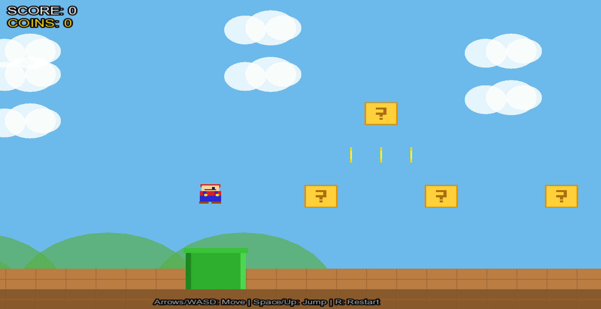

# 🍄 Super Mini Mario (SFML C++)

A lightweight 2D Mario-style platformer written in C++ using SFML.



This project demonstrates core game development concepts:

## 🚀 Features

- 🎮 **Smooth player movement** (run, jump, gravity)
- 🧱 **Tile-based level system** (ground, bricks, question blocks, pipes)
- 🪙 **Collectible coins** with animation
- 👾 **Enemies (Goombas)** with basic AI
- 💥 **Particle effects** (coins, bricks, enemy squash)
- 🏁 **Win condition** via flag
- 💀 **Game over + restart system**
- 📷 **Camera tracking**
- 🎨 **Fully rendered** using SFML shapes (no textures)

## 🎮 Gameplay

The game features classic Mario-style platforming mechanics with:
- Jump on question blocks to collect coins
- Avoid or defeat Goombas by jumping on them
- Navigate through pipes and platforms
- Reach the flag to win!

## 🛠️ Tech Stack

- **Language:** C++
- **Graphics Library:** SFML
- **Architecture:** Object-oriented (single-file)

## 📦 Requirements

- C++17 or later
- SFML 2.5+

## ⚙️ Build Instructions

### Linux / macOS

```bash
g++ Mario.cpp -o mario -lsfml-graphics -lsfml-window -lsfml-system
./mario
```

### Windows (MinGW)

```bash
g++ Mario.cpp -o mario.exe -lsfml-graphics -lsfml-window -lsfml-system
mario.exe
```

Make sure SFML is installed and linked correctly.

## 🎮 Controls

| Action | Keys |
|--------|------|
| Move Left | ← / A |
| Move Right | → / D |
| Jump | Space / ↑ / W |
| Restart | R |
| Exit | ESC |

## 📁 Project Structure
Mario.cpp                      # Main game source
README.md                      # Documentation
Screenshot_2026-05-04_172510.png  # Gameplay screenshot

## 🔧 Future Improvements

- Add textures & sprites
- Sound effects/music
- Multiple levels
- Better enemy AI

## 🎯 Core Concepts Demonstrated

- Physics simulation
- Collision detection
- Tile-based level design
- Entity systems
- Game state management
- Camera systems

---

Made with ❤️ using C++ and SFML
